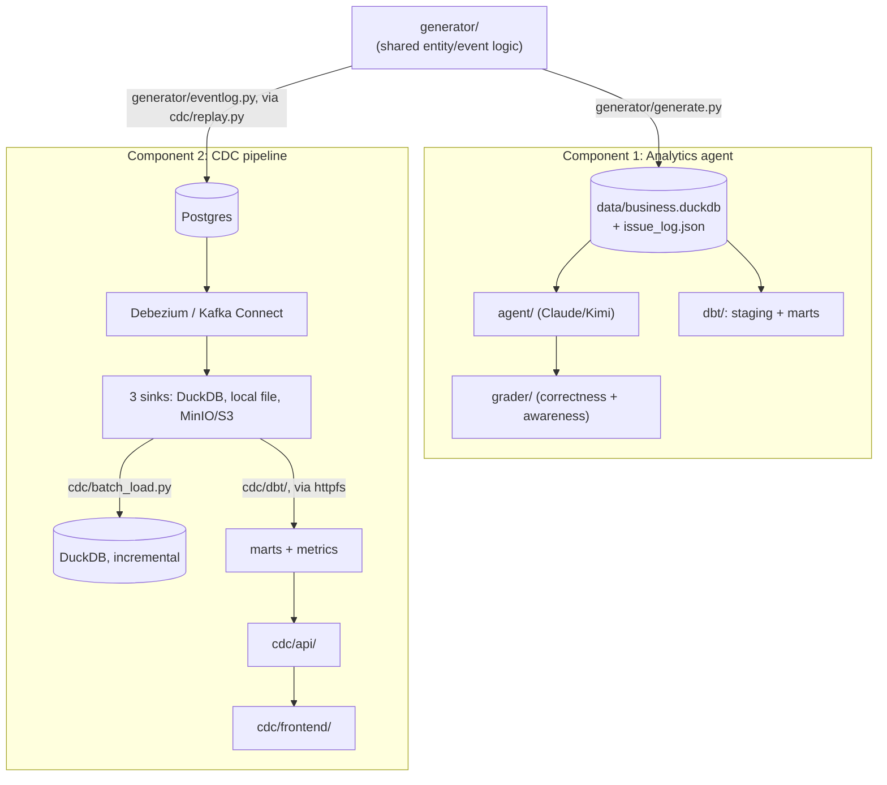

# Analytics Agent Playground

One project, one shared synthetic e-commerce dataset generator, and a
growing set of **data platform components under test** — each one
answering a different question about how well a platform actually holds up
under realistic conditions, not just whether it runs.

| # | Component | Question it answers |
|---|---|---|
| 1 | [Analytics agent](#component-1-analytics-agent) | Does an LLM agent answer business questions correctly, *and* recognize when the data can't support an answer, rather than confidently guessing? |
| 2 | [CDC pipeline](#component-2-cdc-pipeline-optional) | Does a change-data-capture pipeline propagate inserts/updates/deletes correctly, and how much lag does it introduce — at the streaming, batch, and raw-file/SQL layers? |

Components don't depend on each other's output — each is independently
runnable — but they share `generator/`'s entity/event logic, so the same
synthetic business (customers, products, orders, returns, inventory, ...)
underlies every one of them. See "[Adding a new component](#adding-a-new-component)"
for the convention new ones follow.



See `cdc/README.md` for Component 2's own, more detailed diagram and
per-piece verification notes.

## Setup

```bash
python3 -m venv .venv
.venv/bin/pip install -e .
```

Provider credentials (only needed for the ones you use):

```bash
export ANTHROPIC_API_KEY=...          # for --provider claude

export KIMI_API_KEY=...               # for --provider kimi
export KIMI_BASE_URL=https://api.kimi.com/coding   # Kimi's Anthropic-compatible endpoint
```

---

## Component 1: Analytics agent

A synthetic e-commerce business in DuckDB with deliberately injected
data-quality issues, and a benchmark measuring whether an analytics agent
(1) answers business questions correctly and (2) recognizes when the data
is missing, ambiguous, or unreliable rather than confidently answering
anyway.

**Sample result** (one committed run, `benchmark/results/20260822-161540.graded.json` —
Kimi k3-256k, `reasoning_effort=low`, neutral system prompt, no hint to
look for data problems):

| Metric | Result |
|---|---|
| Correctness | 7/10 gradable questions (70%) |
| Awareness recall | 3/15 issue-affected questions flagged (20%) |
| False-positive rate | 0/5 clean questions wrongly flagged (0%) |

The gap between those two numbers is the actual finding: this run got
most *gradable* answers right, but caught the underlying data problem in
only 1 of 5 cases where one existed — and never cried wolf on clean data.
One run, one model, one configuration — not a claim about Kimi models in
general, just what this specific run produced. Re-run and grade with
`--provider claude|kimi --grade` (below) to add more data points; awareness
recall specifically is a lower bound regardless of provider, since the
grader only credits keyword-recognizable hedging (`grader/rubric.py`), not
every way of correctly expressing uncertainty.

### 1. Generate the database

```bash
.venv/bin/python -m generator.generate
```

Builds `data/business.duckdb` (customers, products, orders, order_items,
marketing_spend, sessions, returns, inventory) and injects 9 categories of
realistic data-quality issues on top of it — missing attribution, truncated
history, late-arriving data, duplicate records, category schema drift, currency
ambiguity, silent sampling, orphaned references, and incomplete inventory
snapshots. Ground truth for every injected issue is written to
`data/issue_log.json` (the grading answer key — never shown to the agent).

Regeneration is deterministic (fixed seed), so re-running produces the same data.

### 2. Ask the agent a question directly

```bash
.venv/bin/python -m agent.cli --provider kimi --db data/business.duckdb \
  --question "What was total revenue by acquisition channel?" --verbose
```

`agent/` is a minimal tool-use loop (`run_sql` over a read-only DuckDB connection)
that works against both Claude and Kimi K2/K3 via the same Anthropic Messages API
surface — provider selection is just `--provider claude|kimi` plus the matching env
vars. The system prompt is intentionally neutral (no hint to look for data
problems), and prompt caching is applied to the system prompt, tool schema, and the
growing conversation prefix.

Useful flags: `--model` (override the provider default), `--reasoning-effort
{low,high,max}` (Kimi k3/k3-256k only, default `low`), `--max-turns`,
`--system-prompt`.

### 3. Run the benchmark

```bash
.venv/bin/python -m benchmark.run --provider kimi --grade
```

Drives the agent through every question in `benchmark/questions.yaml` (20
questions: 5 clean, 11 issue-affected, 4 unanswerable), saves raw answers to
`benchmark/results/<run_id>.json`, and `--grade` chains straight into the grader
for an instant scorecard. Useful flags: `--limit N` and `--question-id <id>` for
quick smoke tests.

The agent only ever sees `data/business.duckdb` plus, if you choose to hand it
over, `benchmark/schema_readme.md` (honest column/type docs with zero disclosure
of which issues were injected).

### 4. Grade separately

```bash
.venv/bin/python -m grader.grade --answers benchmark/results/<run_id>.json
```

Scores each answer on two axes:
- **Correctness** — numeric answers extracted from the agent's text, matched
  against `expected_answer` within `tolerance`.
- **Awareness** — for questions with `requires_flag: true`, did the agent's answer
  contain language indicating it noticed the relevant limitation (keyword-based,
  see `grader/rubric.py`)? Also reports a false-positive rate: did it "cry wolf" on
  clean questions where nothing was wrong?

This is a deterministic/keyword grader, not an LLM judge — treat awareness scores
as a lower bound (an agent that flags an issue in unanticipated wording won't be
credited). `grader/fixtures/{good,naive}_answers.json` are reference answer sets
used to sanity-check the grader itself.

### 5. dbt models (optional modeling layer)

```bash
cd dbt && ../.venv/bin/dbt run --profiles-dir .
```

Builds a small staging + marts layer on top of `data/business.duckdb` (schemas
`main_staging` and `main_marts`): one staging model per raw table, plus
`dim_customers`, `dim_products`, and fact tables (`fct_orders`,
`fct_marketing_spend`, `fct_returns`, `fct_inventory_snapshots`).

**This is a faithful, non-cleaning pass-through** — no dedup, no NULL coalescing, no
dropping orphaned references, no status/date filtering. `fct_orders` specifically
uses `LEFT JOIN` (not `INNER JOIN`) to `orders`/`customers`/`products`, so an
orphaned `product_id`/`customer_id` shows up as a NULL join rather than being
silently dropped. The marts carry every injected issue through exactly as raw-table
queries would — they're not a "cleaned" alternative, just a differently-shaped view
of the same data.

**Important**: DuckDB uses file-level locking. `dbt run` opens
`data/business.duckdb` read-write, which conflicts with the agent's read-only
connection (or vice versa) if both try to access the file at the same time. Run
`dbt run` as a standalone step — not while `benchmark/run.py` or `agent/cli.py` is
active — and re-run it after `python -m generator.generate` if you want the marts
schemas refreshed (materialized as views, so they'll reflect new data automatically,
but a fresh DB file needs `dbt run` at least once to recreate the schemas in it).

### Regenerating questions.yaml

`benchmark/questions.yaml`'s expected answers are computed from a clean
(pre-injection) database build, not the served one:

```bash
.venv/bin/python -m benchmark.build_questions
```

Only needs re-running if you change `generator/config.py` (scale, date range) or
edit the question definitions in `benchmark/build_questions.py` directly.

---

## Component 2: CDC pipeline (optional)

```bash
cd cdc && docker compose up -d
.venv/bin/python -m generator.eventlog          # preview the replayable event stream
.venv/bin/python -m cdc.replay --speed 100000   # apply it to Postgres, paced
.venv/bin/python -m cdc.consumer --idle-exit 20 # materialize Kafka's view into DuckDB
.venv/bin/python -m cdc.verify                  # diff the sink against Postgres + report lag
```

`generator/eventlog.py` gives every row a lifecycle (inserts, corrections, late
arrivals, duplicates, retractions) instead of a single final state, and
`cdc/replay.py` applies that stream into Postgres, paced to real/scaled
time so `created_at`/`updated_at` reflect genuine arrival and correction
lag. Debezium/Kafka Connect streams the changes to three independent sinks
— a DuckDB materializer, a local JSONL file, and a MinIO/S3 bucket — and
two more independent paths sit on top of the bucket:

- **`cdc/batch_load.py`** — an incremental Python loader, tracking exactly
  which objects it's already processed (not a timestamp watermark, so it
  stays correct under late-arriving data) and writing to its own DuckDB
  file.
- **`cdc/dbt/`** — dbt-duckdb models reading the raw JSONL directly via
  `httpfs`, squashing the change-event log into current state and
  computing real metrics (revenue by channel, customers by region,
  inventory reorder status) in SQL, with no Python CDC-parsing code
  involved.

`cdc/api/` is a small FastAPI app serving those metrics over HTTP — it
never touches Kafka/Postgres/MinIO itself, only the DuckDB file `dbt run`
produces — including a `/meta` endpoint reporting when the marts were last
refreshed and how far behind the underlying data is right now. `cdc/frontend/`
is a small dashboard (plain HTML/JS, no build step) calling that API,
mounted same-origin so no CORS setup is needed.

See `cdc/README.md` for the full pipeline, what each piece verifies, and
known limitations; `cdc/ARCHITECTURE_DECISIONS.md` for the reasoning
behind the less-obvious choices. Fully independent of `data/business.duckdb`
and Component 1 — nothing here touches the agent or the benchmark.

---

## Adding a new component

The convention so far, if you're adding a third: give it its own top-level
directory (like `cdc/`, not folded into an existing one), let it reuse
`generator/`'s entity/event logic rather than inventing a new dataset, keep
its own `README.md` (and, if the design decisions are non-obvious, its own
`ARCHITECTURE_DECISIONS.md` — Component 2's has been worth it) instead of
cramming everything into this file, and add one row to the table at the top
here plus a `## Component N: ...` section with just enough to get someone
running it and pointed at the deeper docs.

## Repo layout

```
generator/    shared foundation, not a component itself -- entity/event
              generation logic every component builds on. generate.py
              builds Component 1's DuckDB snapshot; eventlog.py builds
              Component 2's replayable event stream
agent/        Component 1: the tool-use analytics agent (run_sql loop, Claude/Kimi providers)
benchmark/    Component 1: schema doc for the agent, questions.yaml, the run.py driver
grader/       Component 1: scoring logic + CLI
dbt/          Component 1: staging + marts modeling layer on top of data/business.duckdb
cdc/          Component 2: Postgres + Debezium/Kafka Connect CDC pipeline
  replay.py, consumer.py, verify.py, batch_load.py, schema_map.py -- the
    Python side: replay, streaming consumer, correctness/lag checks,
    incremental batch loader, and the shared Debezium-envelope decode
    logic all three loaders import
  connect.Dockerfile, connectors/, docker-compose.yml -- Postgres,
    Debezium/Kafka Connect, MinIO, and the sink connector configs
  dbt/        models the raw MinIO storage directly via httpfs (a third,
              independent path onto the same data) -- staging squash
              models + marts/metrics; run.sh wraps `dbt run` to sidestep
              a dbt-duckdb path-resolution footgun
  api/        FastAPI app serving the marts over HTTP
  frontend/   plain HTML/JS dashboard calling the API
  README.md, ARCHITECTURE_DECISIONS.md, FILE_FORMATS.md -- pipeline docs,
              decision records, and the JSONL-vs-Parquet writeup
data/         generated DB + issue_log.json (gitignored, regenerate via generator.generate)
```

See `CHANGELOG.md` for what's implemented as of each tagged release —
`baseline-v1` tracks Component 1, `cdc-v1`/`cdc-v2`/... track Component 2 —
and what's new incrementally at each one.
