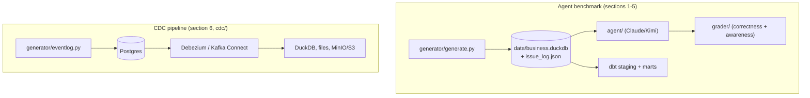

# Analytics Agent Playground

A synthetic e-commerce business (in DuckDB) with deliberately injected data-quality
issues, plus a benchmark that measures whether an analytics agent can (1) answer
business questions correctly and (2) recognize when the data is missing, ambiguous,
or unreliable rather than confidently answering anyway.



Two independent test arms sharing only the `generator/` entity/event logic:
the benchmark asks whether an *agent* answers correctly and notices bad data;
the CDC pipeline asks whether a *change-data-capture pipeline* propagates
changes correctly and how much lag it introduces. Neither depends on the
other's output — see `cdc/README.md` for that arm's own diagram and details.

## Setup

```bash
python3 -m venv .venv
.venv/bin/pip install -e .
```

Provider credentials (only needed for the ones you use):

```bash
export ANTHROPIC_API_KEY=...          # for --provider claude

export KIMI_API_KEY=...               # for --provider kimi
export KIMI_BASE_URL=https://api.kimi.com/coding   # Kimi's Anthropic-compatible endpoint
```

## 1. Generate the database

```bash
.venv/bin/python -m generator.generate
```

Builds `data/business.duckdb` (customers, products, orders, order_items,
marketing_spend, sessions, returns, inventory) and injects 9 categories of
realistic data-quality issues on top of it — missing attribution, truncated
history, late-arriving data, duplicate records, category schema drift, currency
ambiguity, silent sampling, orphaned references, and incomplete inventory
snapshots. Ground truth for every injected issue is written to
`data/issue_log.json` (the grading answer key — never shown to the agent).

Regeneration is deterministic (fixed seed), so re-running produces the same data.

## 2. Ask the agent a question directly

```bash
.venv/bin/python -m agent.cli --provider kimi --db data/business.duckdb \
  --question "What was total revenue by acquisition channel?" --verbose
```

`agent/` is a minimal tool-use loop (`run_sql` over a read-only DuckDB connection)
that works against both Claude and Kimi K2/K3 via the same Anthropic Messages API
surface — provider selection is just `--provider claude|kimi` plus the matching env
vars. The system prompt is intentionally neutral (no hint to look for data
problems), and prompt caching is applied to the system prompt, tool schema, and the
growing conversation prefix.

Useful flags: `--model` (override the provider default), `--reasoning-effort
{low,high,max}` (Kimi k3/k3-256k only, default `low`), `--max-turns`,
`--system-prompt`.

## 3. Run the benchmark

```bash
.venv/bin/python -m benchmark.run --provider kimi --grade
```

Drives the agent through every question in `benchmark/questions.yaml` (20
questions: 5 clean, 11 issue-affected, 4 unanswerable), saves raw answers to
`benchmark/results/<run_id>.json`, and `--grade` chains straight into the grader
for an instant scorecard. Useful flags: `--limit N` and `--question-id <id>` for
quick smoke tests.

The agent only ever sees `data/business.duckdb` plus, if you choose to hand it
over, `benchmark/schema_readme.md` (honest column/type docs with zero disclosure
of which issues were injected).

## 4. Grade separately

```bash
.venv/bin/python -m grader.grade --answers benchmark/results/<run_id>.json
```

Scores each answer on two axes:
- **Correctness** — numeric answers extracted from the agent's text, matched
  against `expected_answer` within `tolerance`.
- **Awareness** — for questions with `requires_flag: true`, did the agent's answer
  contain language indicating it noticed the relevant limitation (keyword-based,
  see `grader/rubric.py`)? Also reports a false-positive rate: did it "cry wolf" on
  clean questions where nothing was wrong?

This is a deterministic/keyword grader, not an LLM judge — treat awareness scores
as a lower bound (an agent that flags an issue in unanticipated wording won't be
credited). `grader/fixtures/{good,naive}_answers.json` are reference answer sets
used to sanity-check the grader itself.

## 5. dbt models (optional modeling layer)

```bash
cd dbt && ../.venv/bin/dbt run --profiles-dir .
```

Builds a small staging + marts layer on top of `data/business.duckdb` (schemas
`main_staging` and `main_marts`): one staging model per raw table, plus
`dim_customers`, `dim_products`, and fact tables (`fct_orders`,
`fct_marketing_spend`, `fct_returns`, `fct_inventory_snapshots`).

**This is a faithful, non-cleaning pass-through** — no dedup, no NULL coalescing, no
dropping orphaned references, no status/date filtering. `fct_orders` specifically
uses `LEFT JOIN` (not `INNER JOIN`) to `orders`/`customers`/`products`, so an
orphaned `product_id`/`customer_id` shows up as a NULL join rather than being
silently dropped. The marts carry every injected issue through exactly as raw-table
queries would — they're not a "cleaned" alternative, just a differently-shaped view
of the same data (groundwork for a future dbt Semantic Layer / MetricFlow metrics
layer, and eventually a second agent experiment arm querying marts instead of raw
tables).

**Important**: DuckDB uses file-level locking. `dbt run` opens
`data/business.duckdb` read-write, which conflicts with the agent's read-only
connection (or vice versa) if both try to access the file at the same time. Run
`dbt run` as a standalone step — not while `benchmark/run.py` or `agent/cli.py` is
active — and re-run it after `python -m generator.generate` if you want the marts
schemas refreshed (materialized as views, so they'll reflect new data automatically,
but a fresh DB file needs `dbt run` at least once to recreate the schemas in it).

## 6. CDC pipeline (optional)

```bash
cd cdc && docker compose up -d
.venv/bin/python -m generator.eventlog          # preview the replayable event stream
.venv/bin/python -m cdc.replay --speed 100000   # apply it to Postgres, paced
.venv/bin/python -m cdc.consumer --idle-exit 20 # materialize Kafka's view into DuckDB
.venv/bin/python -m cdc.verify                  # diff the sink against Postgres + report lag
```

A second, independent test arm alongside the agent benchmark above — this one
tests change-data-capture correctness and lag rather than agent behavior.
`generator/eventlog.py` gives every row a lifecycle (inserts, corrections, late
arrivals, duplicates, retractions) instead of a single final state, replays it
into Postgres (`cdc/replay.py`), and Debezium/Kafka Connect streams the changes
to three different sinks: a DuckDB materializer, a local JSONL file, and a
MinIO/S3 bucket. See `cdc/README.md` for the full pipeline, what each piece
verifies, and known limitations. Fully independent of `data/business.duckdb` and
the sections above — nothing here touches the agent or the benchmark.

## Repo layout

```
generator/    builds the clean DB, then injects the 9 data-quality issues;
              generator/eventlog.py builds the CDC pipeline's replayable event stream
agent/        the tool-use analytics agent (run_sql loop, Claude/Kimi providers)
benchmark/    schema doc for the agent, questions.yaml, the run.py driver
grader/       scoring logic + CLI
dbt/          staging + marts modeling layer on top of data/business.duckdb
cdc/          Postgres + Debezium/Kafka Connect CDC pipeline (replay, consumer,
              verify, and DuckDB/file/MinIO sinks) -- see cdc/README.md
data/         generated DB + issue_log.json (gitignored, regenerate via generator.generate)
```

See `CHANGELOG.md` for what's implemented as of each tagged release
(`baseline-v1`, `cdc-v1`, ...) and what's new incrementally at each one.

## Regenerating questions.yaml

`benchmark/questions.yaml`'s expected answers are computed from a clean
(pre-injection) database build, not the served one:

```bash
.venv/bin/python -m benchmark.build_questions
```

Only needs re-running if you change `generator/config.py` (scale, date range) or
edit the question definitions in `benchmark/build_questions.py` directly.
