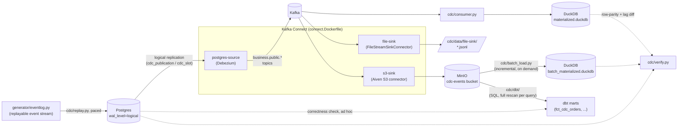

# CDC pipeline

Postgres (OLTP source, logical replication on) → Debezium (Kafka Connect) → Kafka.
Reuses `generator/`'s entity/event logic to write and mutate rows over time so
there's something for CDC to actually capture — see `schema.sql` for the table
DDL and how it differs from the DuckDB copy in `generator/schema.py`.



Three sinks read off the same Kafka topics independently: `cdc/consumer.py`
materializes current state into DuckDB (for `cdc/verify.py`'s correctness/lag
checks), `file-sink` dumps plain local JSONL, and `s3-sink` writes partitioned
JSONL objects to a local MinIO bucket. None of them talk to each other or to
Postgres directly — Kafka is the only thing all three read from.
`cdc/batch_load.py` and `cdc/dbt/` are two more independent paths onto that
*same* underlying MinIO data: the former a Python loader with incremental,
transactional state tracking; the latter plain dbt-duckdb SQL reading the
bucket directly via `httpfs`, with no incremental logic at all (every query
rescans everything under `dt=*`) -- see `ARCHITECTURE_DECISIONS.md` (ADR-5,
ADR-7) for how each compares to `cdc/consumer.py`'s live streaming path.

See `ARCHITECTURE_DECISIONS.md` for *why* this is shaped the way it is —
notably why three independent sinks read the same Kafka topics instead of
one canonical path, and why the file/object-storage sinks are date-partitioned.

## Bring it up

```bash
cd cdc
docker compose up -d
```

This starts, in order: Postgres (schema auto-applied from `schema.sql` on
first boot via `docker-entrypoint-initdb.d`), Zookeeper, Kafka, MinIO (+
`minio-init`, which creates its bucket), Kafka Connect (built from
`connect.Dockerfile` -- see "Sinks: files and MinIO/S3" below for why this
is a custom image rather than the plain Debezium one), and
`connector-init`, a one-shot container that registers every config under
`connectors/*.json` against Connect's REST API once it's healthy. Also
starts `kafka-ui` at http://localhost:8081 for browsing topics/messages
while debugging, and MinIO's own console at http://localhost:9001
(`minioadmin`/`minioadmin`).

Check every connector actually came up:

```bash
for c in postgres-source file-sink s3-sink; do
  curl -s localhost:8083/connectors/$c/status | jq '{name, connector: .connector.state, task: .tasks[0].state}'
done
```

Each should read `RUNNING`/`RUNNING`. If a task is `FAILED`, `.tasks[0].trace`
has the reason (a common one for `postgres-source`: Postgres wasn't done
applying `schema.sql` yet when Connect first tried to snapshot --
`connector-init` retries via the PUT being idempotent, but check the trace).

## What you get

One Kafka topic per table, named `business.public.<table>` (the
`topic.prefix` + schema + table, Debezium's default routing), each message a
Debezium change event with (since both converters run with
`schemas.enable=false`) the payload fields directly at the top level, not
wrapped in a `payload` key: `before`, `after`, `op` (`c`=create, `u`=update,
`d`=delete, `r`=read/snapshot) and `source` (LSN, transaction id, commit
timestamp `ts_ms` — what `cdc/consumer.py` uses for lag measurement).
Deletes also emit a tombstone (null-value) record afterward, per
`tombstones.on.delete`, matching standard Kafka log-compaction convention.
NUMERIC/DECIMAL columns need `decimal.handling.mode: double` (set in
`connectors/postgres-source.json`) to come through as plain numbers rather
than base64-encoded bytes — that flag on the connector config controls
value *encoding*, separate from `schemas.enable`, which only controls
whether the schema is included alongside the value.

Connect's own state (offsets, connector config, task status) lives in three
internal topics (`cdc_connect_*`) — don't touch those, and don't write to a
`business.public.*` topic yourself, or Connect's compaction/offset tracking
gets confused about what it owns.

## Talking to it from outside compose

- Postgres: `localhost:5432`, db `business`, user `business`/`business` for
  direct writes (what `replay.py` will use), or `cdc_replication`/
  `cdc_replication` (replication-only, matches what the connector itself
  uses — don't write through this one).
- Kafka: `localhost:29092` (the `EXTERNAL` listener) for a consumer running
  on the host, e.g. the stream processor in a later stage. Containers talk to
  each other over `kafka:9092` instead.

## Resetting

```bash
docker compose down -v   # -v also drops pg-data, so the schema/publication/
                          # replication slot get recreated clean next `up`
```

A plain `docker compose down` (no `-v`) keeps Postgres data and the
replication slot around, which matters if you want to test what happens to
Debezium's snapshot/resume behavior across a restart — do that deliberately.

## Populating it: the event log + replay

`generator/eventlog.py` builds a replayable event stream on top of the same
entity/event logic `generator.generate` uses for the DuckDB snapshot, except
each row gets a lifecycle instead of a single final state: an INSERT when
it's created, then zero or more UPDATE/DELETE events (order status changes,
marketing spend restatements, refund corrections, late arrivals, duplicates,
retractions). See the module docstring for the full list of mutation
patterns. It's deterministic — same seed, same event stream — and FK-aware:
a child row's event never lands before the parent row it references.

`inventory` is the one table shaped differently from its DuckDB counterpart:
the DuckDB table keeps one row per weekly snapshot (`generator/schema.py`'s
grain, needed for the benchmark's questions), but the Postgres/CDC table
(`cdc/schema.sql`) keeps a single mutable row per `(product_id, warehouse)`
that gets `UPDATE`d in place on every stock movement — a real OLTP
inventory table has nothing to `INSERT` after the first row exists, and a
pile of historical snapshot rows would give CDC nothing to actually
capture. The event log reflects this: the first weekly snapshot for a given
product+warehouse is an INSERT, every later one is an UPDATE of that same
row.

```bash
# apply straight to Postgres (rebuilds the event log in-process)
.venv/bin/python -m cdc.replay --speed 100000

# or dump it first and replay from the file
.venv/bin/python -m generator.eventlog --out /tmp/events.jsonl
.venv/bin/python -m cdc.replay --events-file /tmp/events.jsonl --speed 100000

# fast, unpaced smoke test (no waiting, just checks the pipeline runs end to end)
.venv/bin/python -m cdc.replay --speed asap --limit 5000
```

`--speed` is simulated-seconds-per-real-second: `100000` (the default)
compresses the ~2-year generated date range into roughly 10 real minutes
while keeping every gap strictly ordered and still measurable (a 5-day
correction lag becomes ~4.3 real seconds, not instant) — this is what makes
`created_at`/`updated_at` genuinely reflect arrival/correction lag rather
than a replay-tool artifact, per the earlier design discussion. `asap`
disables pacing (events applied back to back): ordering is still correct,
but the *magnitude* of any lag collapses to near-zero, so use it for pure
mechanics/smoke tests, not lag measurement. `1` replays at true real-time
scale if you want to reproduce lag at the scale it'd actually happen at.

## Materializing + verifying: the consumer

`cdc/consumer.py` consumes the `business.public.*` topics and materializes
current table state into a local DuckDB file, applying each Debezium event
as an upsert (`c`/`u`/`r`) or delete (`d`, followed by the tombstone). It
also logs consumer lag (source commit `ts_ms` vs. when the message was
consumed) to a `_cdc_lag_log` table alongside the data.

```bash
# runs until 20s pass with no new messages -- fine for a batch/test run;
# omit --idle-exit to run indefinitely, like a real consumer service
.venv/bin/python -m cdc.consumer --idle-exit 20

# diff the materialized sink against live Postgres, and print lag percentiles
.venv/bin/python -m cdc.verify
```

`cdc/verify.py` checks two things per table: row parity (every PK in
Postgres should be in the sink, and vice versa -- a mismatch means either
the consumer hasn't caught up, or missed a delete) and the lag distribution
from `_cdc_lag_log`. Exits nonzero on any mismatch, so it's usable as a
smoke test.

**Requires `decimal.handling.mode: double`** on the connector (already set
in `connector-postgres.json`) -- without it, NUMERIC/DECIMAL columns arrive
as base64-encoded bytes rather than plain numbers.

**Consumer group note**: `cdc/consumer.py` defaults to `group.id
cdc-materializer` with offsets auto-committed. Re-running it with the same
group id after it's already caught up will see no new messages (that's
correct Kafka behavior, not a bug) -- pass a different `--group-id` for a
fresh read, or `--no-from-beginning` to only pick up what's new from here.

## Sinks: files and MinIO/S3

Two more sinks run alongside the DuckDB consumer above, both plain Kafka
Connect sink connectors reading the same `business.public.*` topics --
neither needs `cdc/consumer.py` or touches Postgres. Both write JSONL, and
stay that way -- see `FILE_FORMATS.md` for the JSONL-vs-Parquet comparison,
including a live-verified finding that switching `s3-sink` to Parquet
isn't the one-line change it looks like (it needs real schemas on
`postgres-source`, which would break `cdc/consumer.py` and
`cdc/batch_load.py`), and why that cost isn't worth paying here.

- **`file-sink`** (`connectors/file-sink.json`) -- Kafka Connect's built-in
  `FileStreamSinkConnector`. Dumps every topic, interleaved, as one JSON
  object per line to `cdc/data/file-sink/business-events.jsonl` (bind-mounted
  from the `connect` container). Good for "does the exact data reach a file
  at all" checks; no partitioning, no batching, not meant for production use.
- **`s3-sink`** (`connectors/s3-sink.json`) -- Aiven's
  [S3 sink connector](https://github.com/Aiven-Open/s3-connector-for-apache-kafka),
  writing one partitioned JSONL object per topic to a bucket on the `minio`
  service (an S3-API-compatible local object store -- no real AWS account or
  credentials involved). Browse results with `mc` or the MinIO console:

  ```bash
  docker run --rm --network cdc_cdc --entrypoint sh quay.io/minio/mc:latest -c "
    mc alias set local http://minio:9000 minioadmin minioadmin >/dev/null
    mc ls --recursive local/cdc-events
  "
  ```

  Objects land Hive-partitioned by event date:
  `<topic>/dt=<yyyy>-<mm>-<dd>/<partition>-<start_offset>.jsonl`, keyed off
  the Kafka record's own timestamp (`timestamp.source: event`, i.e. when
  Debezium produced the message -- close to when the underlying Postgres
  change actually committed) rather than when the sink happened to process
  it. This is what makes the bucket usable as raw storage other consumers
  can scan by day instead of always reading one ever-growing object per
  topic -- see `ARCHITECTURE_DECISIONS.md` (ADR-2) for why this wasn't there
  from the start. The connector batches in memory and flushes on Connect's
  offset-commit interval (default 60s) or on a rebalance/shutdown -- don't
  expect an object to appear the instant a message is produced; that lag is
  itself worth measuring if you're testing a files/S3-shaped downstream path
  rather than a live consumer.

**Why a custom Connect image (`connect.Dockerfile`)**: verified directly
against a running container (`GET /connector-plugins`) that
`quay.io/debezium/connect` ships *only* Debezium's own source connectors
plus its JDBC sink -- no file or S3 sink, even though
`FileStreamSinkConnector`'s jar happens to already sit in `/kafka/libs`
(it's excluded because `plugin.path` is scoped to `/kafka/connect`, and
Connect's isolated classloader mode ignores anything outside that path).
`connect.Dockerfile` adds both: `FileStreamSinkConnector` by copying that
already-present jar into a scanned plugin directory (no download), and
Aiven's S3 connector by downloading its release tarball. Confirmed by
reading its bytecode directly (not assumed from docs) that it calls
`withPathStyleAccessEnabled` when building its S3 client, so `aws.s3.endpoint`
alone is enough to point it at MinIO -- no separate path-style flag needed.

**A note on Debezium Server**: the natural-sounding alternative --
Debezium's standalone runtime, which pushes change events to a sink
directly with no Kafka in the loop -- does *not* have an official S3/file
sink. Its officially supported sinks are all message-broker-shaped
(Kinesis, Pub/Sub, Pulsar, Redis Streams, NATS, RabbitMQ, ...). A community
project (`debezium-server-batch`) adds S3/GCS/ADLS output, but it requires
building from source with Maven and pulls in Apache Spark as a runtime
dependency just to write files -- too heavy for what this needed. Kafka
Connect sink connectors (above) turned out to be the lighter, better-fit
path to "dump CDC events to files."

## Batch loading: reading the raw storage back, incrementally

`cdc/consumer.py` (above) is a live Kafka consumer. `cdc/batch_load.py` is a
different path to the same materialized-DuckDB outcome: it reads directly
from the `s3-sink` bucket instead of Kafka, on demand rather than
continuously, loading only whatever's landed since it last ran.

```bash
# process whatever's new, then exit
.venv/bin/python -m cdc.batch_load

# repeat every 5 minutes, forever, instead of running once
.venv/bin/python -m cdc.batch_load --loop 300
```

It tracks which objects it's already loaded in a table
(`_cdc_batch_load_state`) inside its own output file, `cdc/batch_materialized.duckdb`
-- one entry per object key (objects are never rewritten once flushed, so
this is exact, not a fuzzy date watermark), with a `processed_at` per key so
there's a real history, not just a current set. Keeping the state in the
same DuckDB file as the data means each object's writes and its "processed"
marker commit in one transaction -- a crash mid-object can't leave one
without the other, it just leaves that object unprocessed, to retry next
run. `batch_materialized.duckdb` is kept separate from `cdc/consumer.py`'s
`materialized.duckdb` on purpose: `cdc/verify.py --materialized
cdc/batch_materialized.duckdb` runs the identical row-parity check against
the batch path, and both loaders' `_cdc_lag_log` tables share a `loader`
column (`'stream'`/`'batch'`) so their lag is directly comparable -- see
`ARCHITECTURE_DECISIONS.md` (ADR-5) for what that comparison actually
showed (batch lag dominated by `s3-sink`'s flush interval, an order of
magnitude higher than streaming lag).

## Transforming the raw storage: dbt reading directly off MinIO

`cdc/dbt/` is a third, independent arm onto the same raw storage
`cdc/batch_load.py` reads -- except instead of a Python loader, it's plain
dbt-duckdb models whose SQL reads the JSONL straight off `s3-sink`'s bucket
via DuckDB's `httpfs` extension, no Python CDC-parsing code at all.

```bash
./cdc/dbt/run.sh          # from anywhere -- e.g. the repo root
# equivalent to, if you'd rather cd in yourself:
#   cd cdc/dbt && ../../.venv/bin/dbt run --profiles-dir .
```

**Use `run.sh`, or `cd` into `cdc/dbt` yourself first -- don't pass
`--project-dir cdc/dbt --profiles-dir cdc/dbt` from elsewhere.**
`profiles.yml`'s `path: cdc_raw.duckdb` is relative to your *current
working directory when you run `dbt`*, not to `--project-dir`. Running from
the repo root with those flags instead of `cd`-ing in silently creates
`cdc_raw.duckdb` at the repo root -- no error, dbt reports success, and
`cdc/api/` (which looks in `cdc/dbt/`) then reports `cdc_raw.duckdb doesn't
exist yet` even though `dbt run` just "succeeded." `run.sh` exists
specifically so this can't happen: it `cd`s into `cdc/dbt` internally
before invoking `dbt`, regardless of where it's called from, and passes any
args straight through (`./cdc/dbt/run.sh build`, etc.). If you've already
hit the stray-file version of this: delete `cdc_raw.duckdb` at the repo
root and re-run via `run.sh`.

**Staging** (`models/staging/stg_cdc_*.sql`, one per table): squashes the
raw change-event log into current state, entirely in SQL --
`row_number() over (partition by pk order by source_ts_ms desc) = 1`,
filtering out rows whose latest `op` is `'d'`. Extracts fields via explicit
JSON-path operators (`value -> 'after' ->> 'col'`), not DuckDB's struct
auto-inference (`read_json_auto`) -- confirmed live that auto-inference
types `before`/`after` differently depending on what data happens to be
present in a given read (a table with zero deletes in the sample gets
`before` typed as generic `JSON`, not `STRUCT`), which would silently need
different SQL per table. Explicit paths work the same way regardless.

**Marts** (`models/marts/*.sql`): actual metrics on top of the squashed
staging layer -- `fct_cdc_orders` (order-level revenue, LEFT JOINed so a
dangling `product_id`/missing items shows up as NULL/zero rather than
disappearing, same principle as `dbt/models/marts/fct_orders.sql` in the
benchmark arm), `mart_revenue_by_channel`, `mart_customers_by_region`,
`mart_inventory_current` (with a derived `needs_reorder` flag).

Verified live, not just "it ran without error": every staging table's row
count matched Postgres exactly; `mart_revenue_by_channel`'s total
(`$9925.46` across 143 completed orders, in one test run) matched an
independently-written Postgres aggregate exactly, computed a different way
(a plain `JOIN`+`SUM`, not the dedup/squash logic the dbt models use);
`sessions`' count matching Postgres exactly is itself a delete-handling
check, since a missed delete would have inflated it.

**Staging** models are `view`s (dbt's default here), so each `dbt run`
re-reads the bucket fresh -- no incremental-load state at all in this arm,
every run rescans every matching object under `dt=*` in full. See
`ARCHITECTURE_DECISIONS.md` (ADR-7) for why that's an acceptable, deliberate
gap for now rather than an oversight. **Marts** are `table`s (overridden in
`dbt_project.yml`), so the rescan happens once per `dbt run`, not once per
*query* against a mart -- important once something other than a human
running `dbt run` by hand is reading these, see "Analytics API" below.

`cdc/dbt/profiles.yml` configures `httpfs` + MinIO's endpoint/credentials
directly (`s3_endpoint`, `s3_url_style: path`, ...) -- separate from
`dbt/profiles.yml` (the benchmark arm's project, pointed at
`data/business.duckdb` with no S3 involved at all).

## Analytics API: serving the marts to a frontend

`cdc/api/` is a small FastAPI app sitting on top of `cdc/dbt/cdc_raw.duckdb`
-- the intended shape for a dashboard frontend to call, rather than
querying DuckDB directly.

```bash
./cdc/dbt/run.sh                          # refresh the marts first
.venv/bin/python -m cdc.api.main          # serves on :8000, docs at /docs
```

It never touches Kafka, Postgres, or MinIO/S3 itself -- only
`cdc_raw.duckdb`, read-only. `dbt run` is the batch step that refreshes the
mart *tables* this API reads; a request here is a plain table read, not a
bucket rescan (which is exactly why marts were switched to `+materialized:
table` above -- an API serving a frontend can't have every request trigger
a full S3 read through several joined views).

Endpoints: `/health` (mart tables present + queryable), `/metrics/revenue-by-channel`,
`/metrics/customers-by-region`, `/metrics/inventory`, `/orders` (paginated,
filterable by `status`/`channel`), `/orders/{order_id}`.

Verified live: every endpoint's output checked against an
independently-written Postgres aggregate, not just against the dbt marts
themselves -- e.g. `/metrics/revenue-by-channel?channel=mobile_app` summed
to the same `$3068.94` a plain Postgres `JOIN`+`SUM` produces (53 orders
worth, reconciled against the mart's per-day grouping via `sum(order_count)`).

Each endpoint opens its own short-lived read-only connection rather than
holding one open for the app's lifetime (same DuckDB single-writer caveat
as `dbt/README.md`'s for the benchmark arm: a `dbt run` and a concurrent API
request can't both hold the file open). There's defensive error-handling
code for that race (a `503` instead of a crash) -- **not actually verified
live**: a real concurrent-write test didn't reproduce the conflict (dbt's
12 tiny models finish in well under half a second, apparently too fast to
reliably overlap with a single test request), so treat that path as
reasonable-but-unconfirmed rather than proven, unlike everything else in
this file.

### Frontend: a small dashboard over the API

`cdc/frontend/` is a plain HTML/CSS/JS page (no build step, no npm) that
calls the endpoints above directly -- one section per mart: a revenue chart
(filterable by channel/date range), a customers-by-region bar chart, an
inventory table (with a needs-reorder filter and highlighted rows), and a
paginated/filterable orders table. Chart.js is loaded from a CDN; everything
else is vanilla `fetch()`.

`cdc/api/main.py` mounts it at `/app` on the *same* FastAPI process that
serves the API -- deliberately same-origin, so the frontend's `fetch()`
calls need no CORS configuration at all. Once the API is running
(`.venv/bin/python -m cdc.api.main`), open http://localhost:8000/app/.

**Verified**: every endpoint's actual JSON response checked field-by-field
against what `app.js` expects (types, date-string format, the specific
`.slice(0, 10)` truncation it applies, `needs_reorder`'s boolean-ness),
plus the exact combined-filter query shapes the JS constructs via
`URLSearchParams` re-run directly against the live API. **Not verified**:
actual visual rendering (chart layout, CSS, the DOM after JS execution) --
no browser automation was available in the environment this was built in,
so this was checked at the data/wiring level only, not by looking at it.
Worth an eyeball pass before trusting it looks right, not just that it
returns right.

## Not done yet

- **`s3-sink` now has an automated correctness check, transitively** --
  `cdc/batch_load.py` reads its output and `cdc/verify.py` runs the same
  row-parity check against that DuckDB file (ADR-5). **`file-sink` still
  doesn't**: it's been verified by hand (sample output, line counts,
  JSON-parse checks) but nothing repeatable reads it back and checks it
  against Postgres.
- `file-sink` has no partitioning (Kafka's built-in `FileStreamSinkConnector`
  has no templating mechanism) -- accepted as-is, see ADR-2.
- `cdc/dbt/`'s models do a full rescan of the bucket on every query -- no
  incremental logic, unlike `cdc/batch_load.py`'s object-key tracking. An
  accepted gap for now, see ADR-7.
- No correctness check comparing `cdc/dbt/`'s marts against `cdc/consumer.py`/
  `cdc/batch_load.py`'s materialized DuckDB files directly (only against
  Postgres) -- would catch a divergence between the three arms specifically,
  not just against ground truth.
- Possible future directions: Parquet/Avro output (both sinks currently write
  plain JSONL), or testing what happens to each sink under a Kafka Connect
  worker restart mid-batch.
- `cdc/frontend/` hasn't been visually verified in a browser -- checked at
  the data/wiring level (response shapes, filter query construction) but
  not by actually looking at the rendered page.
