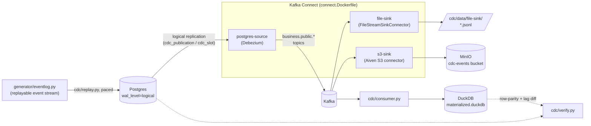

# CDC pipeline

Postgres (OLTP source, logical replication on) → Debezium (Kafka Connect) → Kafka.
Reuses `generator/`'s entity/event logic to write and mutate rows over time so
there's something for CDC to actually capture — see `schema.sql` for the table
DDL and how it differs from the DuckDB copy in `generator/schema.py`.



Three sinks read off the same Kafka topics independently: `cdc/consumer.py`
materializes current state into DuckDB (for `cdc/verify.py`'s correctness/lag
checks), `file-sink` dumps plain local JSONL, and `s3-sink` writes partitioned
JSONL objects to a local MinIO bucket. None of them talk to each other or to
Postgres directly — Kafka is the only thing all three read from.

## Bring it up

```bash
cd cdc
docker compose up -d
```

This starts, in order: Postgres (schema auto-applied from `schema.sql` on
first boot via `docker-entrypoint-initdb.d`), Zookeeper, Kafka, MinIO (+
`minio-init`, which creates its bucket), Kafka Connect (built from
`connect.Dockerfile` -- see "Sinks: files and MinIO/S3" below for why this
is a custom image rather than the plain Debezium one), and
`connector-init`, a one-shot container that registers every config under
`connectors/*.json` against Connect's REST API once it's healthy. Also
starts `kafka-ui` at http://localhost:8081 for browsing topics/messages
while debugging, and MinIO's own console at http://localhost:9001
(`minioadmin`/`minioadmin`).

Check every connector actually came up:

```bash
for c in postgres-source file-sink s3-sink; do
  curl -s localhost:8083/connectors/$c/status | jq '{name, connector: .connector.state, task: .tasks[0].state}'
done
```

Each should read `RUNNING`/`RUNNING`. If a task is `FAILED`, `.tasks[0].trace`
has the reason (a common one for `postgres-source`: Postgres wasn't done
applying `schema.sql` yet when Connect first tried to snapshot --
`connector-init` retries via the PUT being idempotent, but check the trace).

## What you get

One Kafka topic per table, named `business.public.<table>` (the
`topic.prefix` + schema + table, Debezium's default routing), each message a
Debezium change event with (since both converters run with
`schemas.enable=false`) the payload fields directly at the top level, not
wrapped in a `payload` key: `before`, `after`, `op` (`c`=create, `u`=update,
`d`=delete, `r`=read/snapshot) and `source` (LSN, transaction id, commit
timestamp `ts_ms` — what `cdc/consumer.py` uses for lag measurement).
Deletes also emit a tombstone (null-value) record afterward, per
`tombstones.on.delete`, matching standard Kafka log-compaction convention.
NUMERIC/DECIMAL columns need `decimal.handling.mode: double` (set in
`connectors/postgres-source.json`) to come through as plain numbers rather
than base64-encoded bytes — that flag on the connector config controls
value *encoding*, separate from `schemas.enable`, which only controls
whether the schema is included alongside the value.

Connect's own state (offsets, connector config, task status) lives in three
internal topics (`cdc_connect_*`) — don't touch those, and don't write to a
`business.public.*` topic yourself, or Connect's compaction/offset tracking
gets confused about what it owns.

## Talking to it from outside compose

- Postgres: `localhost:5432`, db `business`, user `business`/`business` for
  direct writes (what `replay.py` will use), or `cdc_replication`/
  `cdc_replication` (replication-only, matches what the connector itself
  uses — don't write through this one).
- Kafka: `localhost:29092` (the `EXTERNAL` listener) for a consumer running
  on the host, e.g. the stream processor in a later stage. Containers talk to
  each other over `kafka:9092` instead.

## Resetting

```bash
docker compose down -v   # -v also drops pg-data, so the schema/publication/
                          # replication slot get recreated clean next `up`
```

A plain `docker compose down` (no `-v`) keeps Postgres data and the
replication slot around, which matters if you want to test what happens to
Debezium's snapshot/resume behavior across a restart — do that deliberately.

## Populating it: the event log + replay

`generator/eventlog.py` builds a replayable event stream on top of the same
entity/event logic `generator.generate` uses for the DuckDB snapshot, except
each row gets a lifecycle instead of a single final state: an INSERT when
it's created, then zero or more UPDATE/DELETE events (order status changes,
marketing spend restatements, refund corrections, late arrivals, duplicates,
retractions). See the module docstring for the full list of mutation
patterns. It's deterministic — same seed, same event stream — and FK-aware:
a child row's event never lands before the parent row it references.

`inventory` is the one table shaped differently from its DuckDB counterpart:
the DuckDB table keeps one row per weekly snapshot (`generator/schema.py`'s
grain, needed for the benchmark's questions), but the Postgres/CDC table
(`cdc/schema.sql`) keeps a single mutable row per `(product_id, warehouse)`
that gets `UPDATE`d in place on every stock movement — a real OLTP
inventory table has nothing to `INSERT` after the first row exists, and a
pile of historical snapshot rows would give CDC nothing to actually
capture. The event log reflects this: the first weekly snapshot for a given
product+warehouse is an INSERT, every later one is an UPDATE of that same
row.

```bash
# apply straight to Postgres (rebuilds the event log in-process)
.venv/bin/python -m cdc.replay --speed 100000

# or dump it first and replay from the file
.venv/bin/python -m generator.eventlog --out /tmp/events.jsonl
.venv/bin/python -m cdc.replay --events-file /tmp/events.jsonl --speed 100000

# fast, unpaced smoke test (no waiting, just checks the pipeline runs end to end)
.venv/bin/python -m cdc.replay --speed asap --limit 5000
```

`--speed` is simulated-seconds-per-real-second: `100000` (the default)
compresses the ~2-year generated date range into roughly 10 real minutes
while keeping every gap strictly ordered and still measurable (a 5-day
correction lag becomes ~4.3 real seconds, not instant) — this is what makes
`created_at`/`updated_at` genuinely reflect arrival/correction lag rather
than a replay-tool artifact, per the earlier design discussion. `asap`
disables pacing (events applied back to back): ordering is still correct,
but the *magnitude* of any lag collapses to near-zero, so use it for pure
mechanics/smoke tests, not lag measurement. `1` replays at true real-time
scale if you want to reproduce lag at the scale it'd actually happen at.

## Materializing + verifying: the consumer

`cdc/consumer.py` consumes the `business.public.*` topics and materializes
current table state into a local DuckDB file, applying each Debezium event
as an upsert (`c`/`u`/`r`) or delete (`d`, followed by the tombstone). It
also logs consumer lag (source commit `ts_ms` vs. when the message was
consumed) to a `_cdc_lag_log` table alongside the data.

```bash
# runs until 20s pass with no new messages -- fine for a batch/test run;
# omit --idle-exit to run indefinitely, like a real consumer service
.venv/bin/python -m cdc.consumer --idle-exit 20

# diff the materialized sink against live Postgres, and print lag percentiles
.venv/bin/python -m cdc.verify
```

`cdc/verify.py` checks two things per table: row parity (every PK in
Postgres should be in the sink, and vice versa -- a mismatch means either
the consumer hasn't caught up, or missed a delete) and the lag distribution
from `_cdc_lag_log`. Exits nonzero on any mismatch, so it's usable as a
smoke test.

**Requires `decimal.handling.mode: double`** on the connector (already set
in `connector-postgres.json`) -- without it, NUMERIC/DECIMAL columns arrive
as base64-encoded bytes rather than plain numbers.

**Consumer group note**: `cdc/consumer.py` defaults to `group.id
cdc-materializer` with offsets auto-committed. Re-running it with the same
group id after it's already caught up will see no new messages (that's
correct Kafka behavior, not a bug) -- pass a different `--group-id` for a
fresh read, or `--no-from-beginning` to only pick up what's new from here.

## Sinks: files and MinIO/S3

Two more sinks run alongside the DuckDB consumer above, both plain Kafka
Connect sink connectors reading the same `business.public.*` topics --
neither needs `cdc/consumer.py` or touches Postgres.

- **`file-sink`** (`connectors/file-sink.json`) -- Kafka Connect's built-in
  `FileStreamSinkConnector`. Dumps every topic, interleaved, as one JSON
  object per line to `cdc/data/file-sink/business-events.jsonl` (bind-mounted
  from the `connect` container). Good for "does the exact data reach a file
  at all" checks; no partitioning, no batching, not meant for production use.
- **`s3-sink`** (`connectors/s3-sink.json`) -- Aiven's
  [S3 sink connector](https://github.com/Aiven-Open/s3-connector-for-apache-kafka),
  writing one partitioned JSONL object per topic to a bucket on the `minio`
  service (an S3-API-compatible local object store -- no real AWS account or
  credentials involved). Browse results with `mc` or the MinIO console:

  ```bash
  docker run --rm --network cdc_cdc --entrypoint sh quay.io/minio/mc:latest -c "
    mc alias set local http://minio:9000 minioadmin minioadmin >/dev/null
    mc ls --recursive local/cdc-events
  "
  ```

  Objects land as `<topic>/<partition>-<start_offset>.jsonl`. The connector
  batches in memory and flushes on Connect's offset-commit interval (default
  60s) or on a rebalance/shutdown -- don't expect an object to appear the
  instant a message is produced; that lag is itself worth measuring if
  you're testing a files/S3-shaped downstream path rather than a live
  consumer.

**Why a custom Connect image (`connect.Dockerfile`)**: verified directly
against a running container (`GET /connector-plugins`) that
`quay.io/debezium/connect` ships *only* Debezium's own source connectors
plus its JDBC sink -- no file or S3 sink, even though
`FileStreamSinkConnector`'s jar happens to already sit in `/kafka/libs`
(it's excluded because `plugin.path` is scoped to `/kafka/connect`, and
Connect's isolated classloader mode ignores anything outside that path).
`connect.Dockerfile` adds both: `FileStreamSinkConnector` by copying that
already-present jar into a scanned plugin directory (no download), and
Aiven's S3 connector by downloading its release tarball. Confirmed by
reading its bytecode directly (not assumed from docs) that it calls
`withPathStyleAccessEnabled` when building its S3 client, so `aws.s3.endpoint`
alone is enough to point it at MinIO -- no separate path-style flag needed.

**A note on Debezium Server**: the natural-sounding alternative --
Debezium's standalone runtime, which pushes change events to a sink
directly with no Kafka in the loop -- does *not* have an official S3/file
sink. Its officially supported sinks are all message-broker-shaped
(Kinesis, Pub/Sub, Pulsar, Redis Streams, NATS, RabbitMQ, ...). A community
project (`debezium-server-batch`) adds S3/GCS/ADLS output, but it requires
building from source with Maven and pulls in Apache Spark as a runtime
dependency just to write files -- too heavy for what this needed. Kafka
Connect sink connectors (above) turned out to be the lighter, better-fit
path to "dump CDC events to files."

## Not done yet

Nothing outstanding at the sink layer for now -- DuckDB, local files, and
MinIO/S3 are all covered. Possible future directions: Parquet/Avro output
(both sinks above write plain JSONL), or testing what happens to each sink
under a Kafka Connect worker restart mid-batch.
